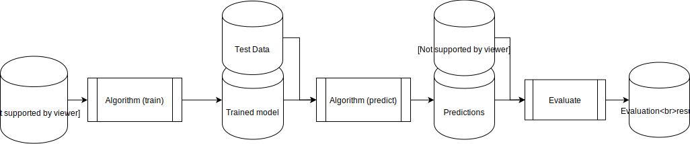

This website is part of the [TADPOLE-SHARE project](https://www.esciencecenter.nl/project/tadpole-share) awarded to [Esther Bron](https://www.esciencecenter.nl/news/the-winner-of-the-young-escientist-award-2018-is) (Erasmus MC) by the [Netherlands eScience Center](https://www.esciencecenter.nl/). This project builds upon the [TADPOLE challenge](https://tadpole.grand-challenge.org/) and provides an example of how algorithms for predicting Alzheimer’s disease can be made available for further development and re-use. We provide tutorials and example code for the EMC-EB algorithm that participated in the TADPOLE challenge.

### The TADPOLE challenge

The [challenge](https://tadpole.grand-challenge.org/) on which this project was based was concluded on the 16th of November 2017, with a [paper](https://arxiv.org/abs/1805.03909) submitted on the 11th of May 2018. The goal of this challenge was twofold:
- Identify individuals that are likely to need and respond to treatment. AD treatments are most likely to be effective at early disease stages, even before any outward signs of dementia.
- Accurately predict the change in disease indicators so that we can assess the effect of the treatment.

During the course of this challenge several machine learning algorithms were created to tackle these research questions. 

### TADPOLE-SHARE

To allow further investigation of the methods used in the original challenge, the challenges organizers have asked the participants to submit their algorithms / workflows in such a way that they can be repeated for different test and training data sets. Some challenge participants have already shared their algorithms.

There are currently three algorithms available:
- [BenchmarkLastVisit](https://github.com/tadpole-share/tadpole-algorithms/tree/master/tadpole_algorithms/models/benchmark_last_visit)
- [BenchmarkSVM](https://github.com/tadpole-share/tadpole-algorithms/tree/master/tadpole_algorithms/models/simple_svm)
- [EMC-EB](https://github.com/tadpole-share/tadpole-algorithms/tree/master/tadpole_algorithms/models/ecmeb)

### Try it yourself!
[](https://zenodo.org/badge/latestdoi/188199845)

The algorithms are available as a [python package](https://github.com/tadpole-share/tadpole-algorithms/). 
A good starting point is the [Jupyter Lab](https://github.com/tadpole-share/jupyter) environment created by the
Netherlands eScience Center.
This will hopefully inspire newcomers to the field of alzheimer prediction to try their own variations, and to see if 
they can improve upon the accuracy or speed of the predictions.

### Make your own algorithm compatible
[](https://zenodo.org/badge/latestdoi/227615738)

Your algorithms can benefit from the TADPOLE-SHARE infrastructure. To make this work, they should conform to a standardized interface as defined for TADPOLE-SHARE. It roughly follows the [original challenges](https://tadpole.grand-challenge.org/) design. 

In the [tadpole-algorithms](https://github.com/tadpole-share/tadpole-algorithms) repository, the Netherlands eScience Center has made an effort
to generalize one of the algoritms for further use. This repository will now function as a template for other algorithms which want to benefit from this approach as well. In this repository, we have made sure that the code conforms to the FAIR standards for open and reproduceable science.



The standardized interface requires users to implement the following functions:

*train(training_set: pd.DataFrame)*  
Train the machine learning model on the [input data](https://tadpole.grand-challenge.org/Data/) to prepare it for predictions. We use D1 and D2 of the referenced set in this step.

*predict(test_set: pd.DataFrame)*  
Predict the next state for all of the subjects in the test set. This step uses D3 of the referenced dataset.

The output of the predictions should be a DataFrame containing predictions for each patient / RID,
for each month for the following 10 years, with the following fields:
```
{
    'RID': [RID / patient ID],
    'month': [prediction month (after last EXAM_DATE for this RID), number between 1 and 120],
    'Forecast Date': [Forecast date in 'YYYY-MM-DD' format],
    'CN relative probability': [number],
    'MCI relative probability': [number],
    'AD relative probability': [number],

    'ADAS13': [number],
    'ADAS13 50% CI lower': [number],
    'ADAS13 50% CI upper': [number],

    'Ventricles_ICV': [number],
    'Ventricles_ICV 50% CI lower': [number],
    'Ventricles_ICV 50% CI upper': [number],
}
```
